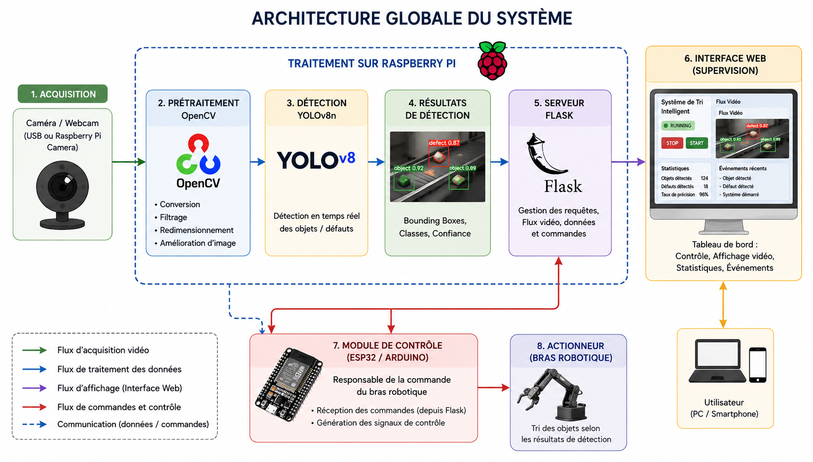

# 🤖 Intelligent Robotic Arm for Bottle Defect Sorting


## 📌 Project Overview

This repository contains the source code and documentation for a Master's thesis project: **Development of an automated sorting system using a robotic arm controlled by ESP32 and Artificial Intelligence (YOLO).**

The system is designed for industrial quality control, specifically targeting the real-time detection and sorting of plastic bottles based on their physical condition. It uses a hybrid architecture combining Computer Vision (OpenCV), Edge AI (YOLOv8n on Raspberry Pi 4), and Mechatronics (ESP32 and Servomotors).

### ✨ Key Features

- **Real-Time Defect Detection:** Identifies 5 specific bottle classes: `cap`, `no-cap`, `label`, `crumbled`, and `not-crumbled`.
- **Edge AI Processing:** Runs inference locally on a Raspberry Pi 4 using a highly optimized YOLOv8-nano model (~4 FPS).
- **Remote Supervision:** Provides a web-based dashboard built with Flask for live video streaming, logging, and system monitoring.
- **Automated Sorting:** Controls a 4-DOF robotic arm via an ESP32 microcontroller over a local Wi-Fi Hotspot network.

---

## 🏗️ System Architecture



The system is divided into three main layers:

1. **Vision & AI Layer (Raspberry Pi + WebCam):** Captures the video stream, runs the YOLOv8n model, and classifies the object.
2. **Supervision Layer (Flask):** Hosts the Web UI and manages communication (Wi-Fi/Hotspot) between the AI and the hardware.
3. **Control Layer (ESP32 + Servomotors):** Receives target commands and executes the physical Pick & Place operation to the appropriate sorting bin.

---

## 📂 Repository Structure

```text
📦 Smart-Robotic-Arm-Sorter
 ┣ 📂 docs/               # Architecture diagrams, thesis PDF, and images
 ┣ 📂 dataset/            # Sample images and links to the Roboflow dataset
 ┣ 📂 src/
 ┃ ┣ 📂 vision/           # YOLOv8 inference scripts and OpenCV tracking
 ┃ ┣ 📂 web/              # Flask application (app.py, HTML templates, CSS)
 ┃ ┗ 📂 robot_control/    # C++/Arduino code (.ino) for the ESP32
 ┣ 📜 requirements.txt    # Python dependencies
 ┗ 📜 README.md           # Project documentation

---

## 🚀 Installation & Setup

### 1. Prerequisites
- Raspberry Pi 4 (or a PC) with Python 3.9+
- Arduino IDE (for ESP32 flashing)
- USB WebCam
- ESP32 NodeMCU-32S & 4x Servomotors (SG90/MG996R)

### 2. Software Setup (Raspberry Pi / PC)
Clone the repository and install the required Python libraries:
```bash
git clone https://github.com/SamRepository/Smart-Robotic-Arm-Sorter.git
cd Smart-Robotic-Arm-Sorter
pip install -r requirements.txt
```

### 3. Hardware Setup (ESP32)

1. Open `src/robot_control/robot_control.ino` in the Arduino IDE.
2. Update the Wi-Fi credentials to match your local Hotspot.
3. Compile and upload the code to the ESP32.

### 4. Running the System

Start the Flask web server and the AI pipeline:

```bash
cd src/web
python app.py
```

Open your web browser and navigate to `http://<RASPBERRY_PI_IP>:5000` to access the supervision dashboard.

---

## 📊 Dataset & Model Performance

The custom YOLOv8n model was trained on the **"Bottle Defect Detection"** dataset (590 images with augmentation), annotated via Roboflow.

- **Global mAP@50:** 91%
- **Physical Sorting Success Rate:** 76% (based on a 50-bottle real-world test).

---

## 🎓 Credits

- **Author:** Bougueroua Nada
- **Co-Author:** Lamine
- **Supervisor:** Dr. Sellami Samir
- **Institution:** Université 20 Août 1955 - Skikda (Département d'Informatique)
- **Academic Year:** 2025 / 2026

```

```
